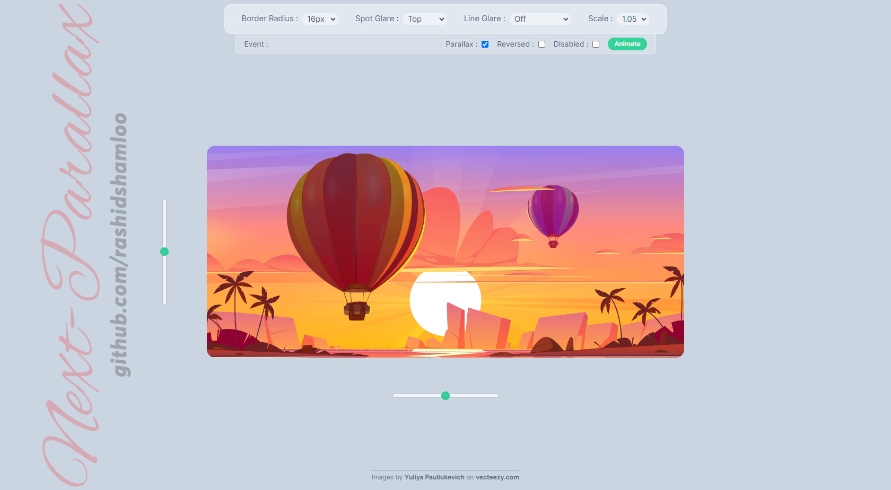
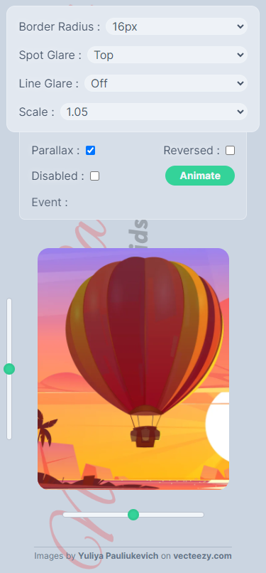
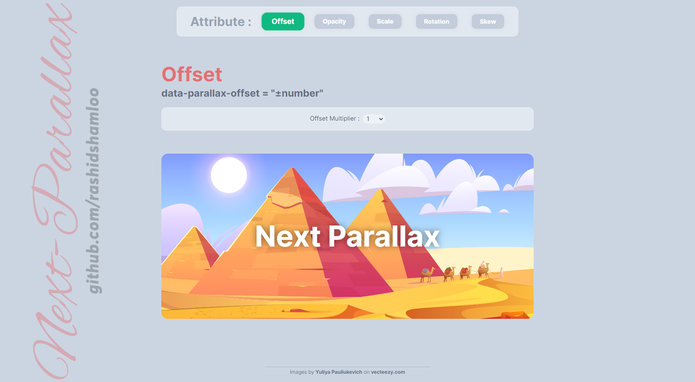
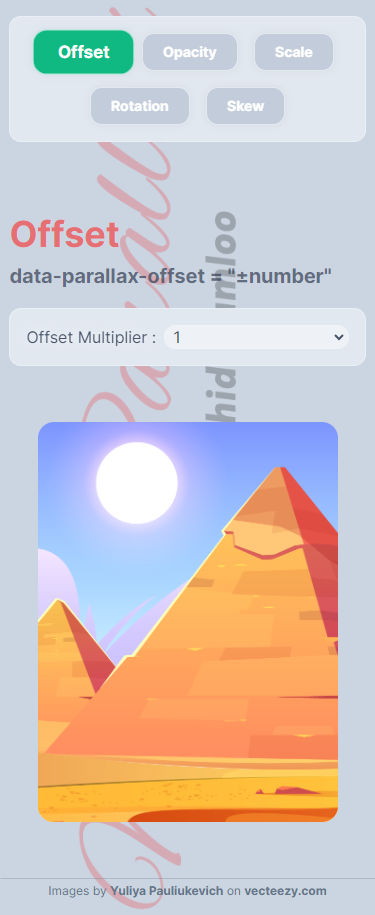
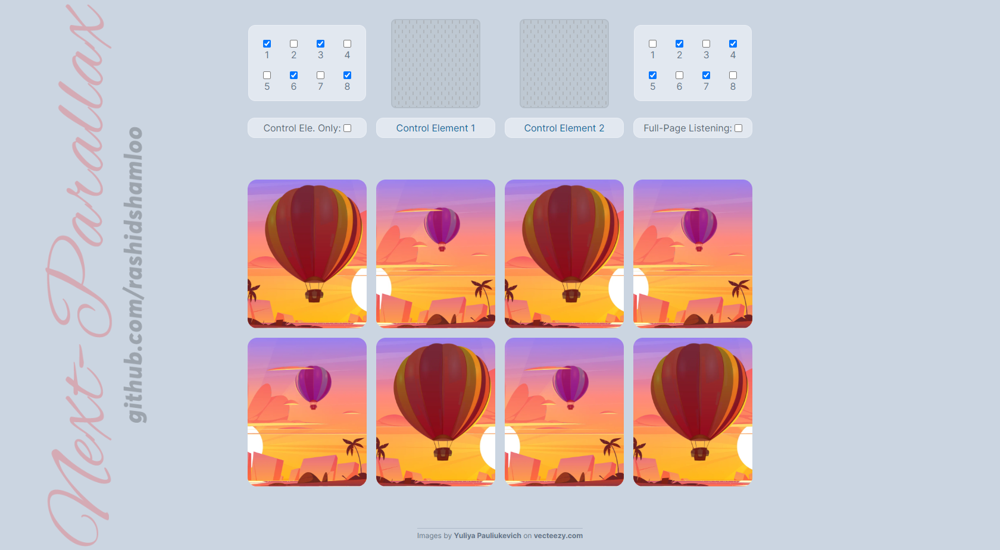
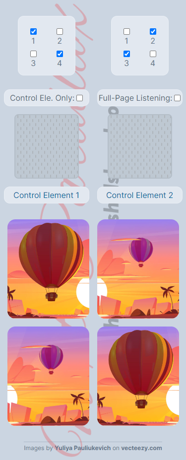

# react-next-parallax Demo

This is the Demo for the [react-next-parallax](https://www.npmjs.com/package/react-next-parallax) package.

## Table of contents

- [Links](#links)
- [Built with](#built-with)
- [Screenshot](#screenshot)
- [Credits](#credits)
- [Useful Resources](#useful-resources)
- [Author](#author)

## Links

- Main Demo: https://rashidshamloo.github.io/react-next-parallax_demo
- Attributes Demo: https://rashidshamloo.github.io/react-next-parallax_demo/attributes
- Control Element Demo: https://rashidshamloo.github.io/react-next-parallax_demo/control-element
- react-next-parallax Package: https://www.npmjs.com/package/react-next-parallax
- react-next-parallax Repository: https://github.com/rashidshamloo/react-next-parallax

## Built with

- TypeScript
- React.js
- React Router
- Tailwind CSS
- Vite.js

## Screenshot

- Main Demo

  - Desktop

  

  - Mobile

  

- Attributes Demo

  - Desktop

  

  - Mobile

  

- Control Element Demo

  - Desktop

  

  - Mobile

  

## Credits

- Images by [Yuliya Pauliukevich](https://www.vecteezy.com/members/klyaksun) on [vecteezy.com](https://www.vecteezy.com/)

## Useful Resources

- [Single Page Apps for GitHub Pages](https://github.com/rafgraph/spa-github-pages) - A solution for running React Router on GitHub Pages without using the Hash Router.
- [react-responsive](https://www.npmjs.com/package/react-responsive) - The package used for detecting different screen sizes.
- [tailwindcss-3d](https://www.npmjs.com/package/tailwindcss-3d) - The package used for adding 3D transforms to Tailwind CSS.

## Author

Rashid Shamloo

- Portfolio - [rashidshamloo.ir](https://www.rashidshamloo.ir)
- Linkedin - [rashid-shamloo](https://www.linkedin.com/in/rashid-shamloo/)
- Frontend Mentor - [@rashidshamloo](https://www.frontendmentor.io/profile/rashidshamloo)
- Twitter - [@rashidshamloo](https://www.twitter.com/rashidshamloo)
- Dev.to - [@rashidshamloo](https://dev.to/rashidshamloo)
